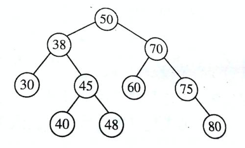
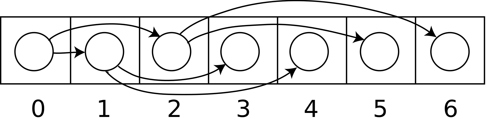
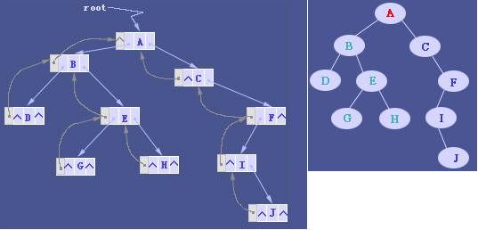

## 二叉树

### 1.1 二叉树分类
1. 完全二叉树 除最后一层，其他各层结点都达到最大数，最后一层子结点是从左到又依次排列
2. 满二叉树  除了叶结点外，每一个结点都有左右子叶并且处在最底层。
3. 平衡二叉树（AVL） 它是一 棵空树或它的左右两个子树的高度差的绝对值不超过1，并且左右两个子树都是一棵平衡二叉树。

### 1.2 二叉树存储表示

这里使用js实现来记录下二叉树的相关示例。
示例二叉树：


#### 1.2.1 顺序存储表示

使用数组等线性表表示。索引为i的结点，左子结点为2i+1，右子结点为2i+2，父结点为(i-1)/2向下取整。



上图摘自维基百科。

优点：非常容易访问到某个结点。

缺点：需要连续的存储空间，如果有缺失结点，会造成存储空间浪费。

``` javascript
// 使用数组表示的示例二叉树
// 空结点需要使用null填充
// 其实也就是从第一层开始，逐层写入数组，
let binaryTree = [
  50, 38, 70, 30, 45, 60, 75, null, null, 40, 48, null, null, null, 80
];
```

#### 1.2.2 二叉树链表表示

链表表示在有指针或者类似指针结构的语言中可以很方便的表示出来。

上图摘自维基百科。

优点：节省存储空间。

缺点：访问某个结点不太容易。

``` typescript
// js中可以直接使用具有，data/parent/left/right四个属性的类表示结点
// js中对象的引用其实就是和指针类似
class BinaryTreeNode {
  constructor(
    public data: any,
    public parent: BinaryTreeNode,
    public left: BinaryTreeNode,
    public right: BinaryTreeNode
  ){}
}
```

### 1.3 遍历方法

#### 1.3.1 深度优先

前序NLR/NRL，中序LNR/RNL，后序LRN/RLN。
前中后序指的是读取当前结点数据的顺序。前序即先读取当前结点数据，中序是中间读取，后序是最后读取。至于左右子节点的遍历顺序，是对称的，因而只分三类遍历。

#### 1.3.2 广度优先

广度优先也可说是层次遍历。即从根节点开始，逐层遍历所有结点。

```
class BinaryTreeNode {
  constructor(
    public data: any,
    public parent: BinaryTreeNode = null,
    public left: BinaryTreeNode = null,
    public right: BinaryTreeNode = null
  ){}
}

class BinaryTreeUtils {

  /**
   * 深度优先-前序遍历（递归）
   * **/
  static preOrderByRecursion(root: BinaryTreeNode, callback: Function = null){
    callback && callback(root.data);
    root.left && BinaryTreeUtils.preOrderByRecursion(root.left, callback);
    root.right && BinaryTreeUtils.preOrderByRecursion(root.right, callback);
  }
  /**
   * 深度优先-前序遍历（循环）
   * **/
  static preOrderByLoop(root: BinaryTreeNode, callback: Function = null){
    let stack: Array<BinaryTreeNode> = [];
    let current = root;
    while (current || stack.length > 0){
      current = current || stack.pop();
      callback && callback(current.data);
      current.right && stack.push(current.right);
      current.left && stack.push(current.left);
      current = null;
    }
  }

  /**
   * 深度优先-中序遍历（递归）
   * **/
  static inOrderByRecursion(root: BinaryTreeNode, callback: Function = null){
    root.left && BinaryTreeUtils.inOrderByRecursion(root.left, callback);
    callback && callback(root.data);
    root.right && BinaryTreeUtils.inOrderByRecursion(root.right, callback);
  }
  /**
   * 深度优先-中序遍历（循环）
   * **/
  static inOrderByLoop(root: BinaryTreeNode, callback: Function = null){
    let stack: Array<BinaryTreeNode> = [];
    let current = root;

    while(current || stack.length > 0){
      if(current && current.left){
        stack.push(current);
        current = current.left;
      }
      else{
        current = current || stack.pop();
        callback && callback(current.data);
        current = current.right || null;
      }
    }
  }

  /**
   * 深度优先-后序遍历（递归）
   * **/
  static postOrderByRecursion(root: BinaryTreeNode, callback: Function = null){
    root.left && BinaryTreeUtils.postOrderByRecursion(root.left, callback);
    root.right && BinaryTreeUtils.postOrderByRecursion(root.right, callback);
    callback && callback(root.data);
  }
  /**
   * 深度优先-后序遍历（循环）
   * **/
  static postOrderByLoop(root: BinaryTreeNode, callback: Function = null){
    let stack: Array<BinaryTreeNode> = [];
    let current = root;

    while (current || stack.length > 0) {
    }
  }
}


let root = new BinaryTreeNode(50);
root.left = new BinaryTreeNode(38);
root.right = new BinaryTreeNode(70);
root.left.left = new BinaryTreeNode(30);
root.left.right = new BinaryTreeNode(45);
root.left.right.left = new BinaryTreeNode(40);
root.left.right.right = new BinaryTreeNode(48);
root.right.left = new BinaryTreeNode(60);
root.right.right = new BinaryTreeNode(75);
root.right.right.right = new BinaryTreeNode(80);

let result1 = [];
let result2 = [];

BinaryTreeUtils.postOrderByRecursion(root, function (data) {
  result1.push(data);
});

BinaryTreeUtils.postOrderByLoop(root, function (data) {
  result2.push(data);
});
console.log(result1);
console.log(result2);

```


